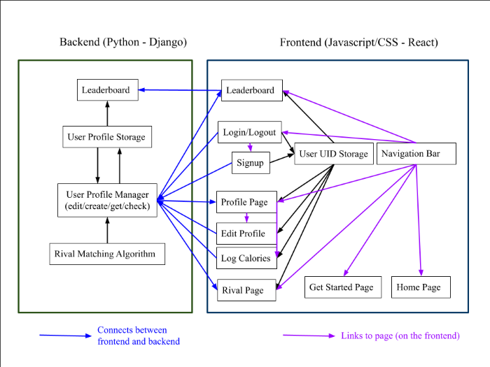

# Calorie Clash
**Group 101:**
- *Frontend Developers:* Gloria Li (glorial4), Sai Dasari (saisd2)
- *Backend Developers:* Warren Li (warrenl2), Ben Guan (bg16)

## Table of Contents
- [Introduction](#introduction)
- [Technical Architecture](#technical_architecture)
- [Required Downloads](#required_downloads)
- [How to Run](#how_to_run)

## Introduction <a name="introduction"></a>

Staying healthy and working out are sometimes things that can be hard to find the motivation for. 

Calorie Clash will help track calories burned by a registered user and find and match individuals as “rivals” based on fitness level and activity to bolster fitness competition and comradery where many can’t find it. Users can also view a leaderboard of top 10 calorie burners out of all users to find some extra motivation as well. 

While there are many fitness tracker programs available, Calorie Clash’s rival system adds an additional rivals system to the mix for additional fitness motivation and the ability to build fitness camaraderie between people all across the world. 


## Technical Architecture <a name="technical_architecture"></a>



### Backend (Django) Features:
- [Leaderboard](#leaderboard_b)
- [User Profile Storage](#ustorage)
- [User Profile Manager](#umanager)
- [Rival Matching Algorithm](#rival_match)

#### *Leaderboard (Ben)* <a name="leaderboard_b"></a>

The leaderboard section of the website shows the top 10 users with the most calories burned today. Users can see how they compare to others and compete for the top rankings if they wish. This component works by sending a GET request to a specfic URL endpoint in the backend, which will then filter and return a list of the top ten users by calories burned from the User Profile Storage / database. 

#### *User Profile Storage (Ben/Warren)* <a name="ustorage"></a>

Using Django and its integrated SQLite database, we created a UserProfile model that stores the main characteristics of each user who uses the Calorie Clash website. These models are stored within the database, and hold information about each user and their calorie statistics, body type, and workout preferences. Additionally, a custom user model was created to hold information about each user's registration info for the website, namely their email, username, and password. These two models were linked together in the database by an assigned UID number. The User Profile Manger and Leaderboard components look within the database to fetch relevant information that is needed for displaying on the frontend. 

#### *User Profile Manager (edit/get/check/create)* (Ben/Warren) <a name="umanager"></a>

THe User Profile Manager is the main API for handling various requests to the backend using HTTP URL endpoints. When a fetch request is sent from the various frontend components (Leaderboard, Login/Logout, Signup, Profile pages, Calorie logger, etc.), these requests are handled by this component. This includes retrieving a user's or list of user's information for profile pages / the leaderboard (GET), creating new users and their associative User Profile using information from the Signup form (POST), editing user information through the Log Calories and Edit Profile components (POST), as well as checking the submitted password against the encrypted version on the backend for logging in (POST). 

#### *Rival Matching Algorithm (Warren)* <a name="rival_match"></a>

Insert description and how it connects to other parts here.

### Frontend (React) Features
- [Leaderboard](#leaderboard_f)
- [User UID Storage](#uid_storage)
- [Login/logout](#login)
- [Signup](#signup)
- [Profile Page](#profile)
- [Naviagtion Bar](#nav_bar)
- [Log Calories](#log_calories)
- [Edit Profile](#edit_profile)
- [Rivals Page](#rivals)
- [Getting Started](#getting_started)
- [Home Page](#home)

#### *Leaderboard (Gloria/Sai/Ben)* <a name="leaderboard_f"></a>

A page that shows the leaderboard of the top 10 calorie burners out of all users in a table. 
Gets the leaderboard from the leaderboard api on the backend. 
Also shows user's current stats if they're logged in. 

#### *User UID Storage (Gloria)* <a name="uid_storage"></a>

Stores the user's UID in window.localstorage if user is logged in and is used to get user information from the backend. 
If not logged in, there is nothing in storage (null).
Needs cookies enabled to work. 


#### *Login/logout (Sai/Gloria)* <a name="login"></a>

Logs the user in based on a username and password that is checked for matches in the backend's user profile check. 
The user's UID is returned from the backend's user profile check if the login is successful and the UID is stored in local storage in the frontend for future get requests for the backend. If the user profile check fails, an error is shown.

Logs the user out by clearing the local storage so the user's UID is no longer stored. 

(Note: Does not have the functionality to change user password at the moment)

#### *Signup (Gloria)* <a name="signup"></a>

Form for signing up as a user. Takes in username, first and last name, email, password, and password confirmation.
Certain password restrictions are enforced (8 character min, 1 upper and lowercase letter, 1 special character, and 1 digit).

If the information passes all password checks on the frontend, the data is sent to the backend's user profile creation api to
create a profile and the user's UID is returned from the backend and stored in the frontend's local storage if the profile was successfully created. The user profile page will open then after a success message.

If there is a matching username already in existance, the backend will throw an error that the frontend will display and it will stay on the signup form.

#### *Profile Page (Gloria/Sai)* <a name="profile"></a>

Shows the user's current information (first name, last name, pronouns, weight, height (ft), height (in), workout preferences,
and calories burned). Gets this information from the backend's user profile get/edit api using the uid that was stored in local
storage, if logged in.

If there is not UID stored, the page redirects to the login page. 

Also, has buttons that link to the edit profile form and log calories form. 

#### *Navigation Bar (Sai)* <a name="nav_bar"></a>

Navigation bar at the top of the page that links to the get started, home, leaderboard, profile, rival, and login/logout page.
Shows login/logout depending on if a user UID is stored (logged in) or not (logged out).

#### *Log Calories (Gloria/Sai)* <a name="log_calories"></a>

Form that the user can use to log calories. Links to an external calorie calculator as a resource if necessary. Can only input
integers 0 or greater for number of calories burned.
Once the form is submitted, the information is sent to the backend where the user profile is edited to account for the new
amount of calories logged and the profile page is opened after a success message shows.

#### *Edit Profile (Gloria)* <a name="edit_profile"></a>

Form that the user can use to change their user information (first name, last name, pronouns, weight, height (ft), height (in), 
and workout preferences). Using the stored user UID, sends this infomration to the backend's specific user profile edit/get api
to update the information stored. The profile page is opened after a success message shows.

#### *Rival Page (Sai)* <a name="rivals"></a>

Similar to the user profile page but instead of the user's information it's the user's rival information. Gets the user's rival
UID by using the user's stored UID to get the user's profile from the backend which has the rival's UID. Then, with the rival's
UID, the rival's profile information from the backend's user profile get/edit api is stored and displayed. 

#### *Getting Started Page (Sai)* <a name="getting_started"></a>

Tutorial page that explains how to use the Calorie Clash.

#### *Home Page (Gloria)* <a name="home"></a>

Introduction page that explains what Calorie Clash is and its purpose.

## Required Downloads <a name="required_downloads"></a>

### For the Django Backend:
- Django
- Python
- Django Rest Framework
- Django Cors Headers

Python download: [Python.org](https://www.python.org/)

Once python is installed, the other programs/additions can be downloaded via the code below:

```
pip install django
pip install djangorestframework
pip install django-cors-headers
```

### For the React Frontend:
- Node.js (version 14 or later)
- Npm (version 5.6 or later)
- React Router DOM

Node.js download: [Node.js](https://nodejs.org/en/)

Download commands for other components:
```
npm install -g npm
npm i react-router-dom
```

Checking versions:
```
node -v
npm -v
```

## How to Run <a name="how_to_run"></a>

To run Calorie-Clash, you need to run both the backend and frontend servers (instructions below).


### Django Backend:
1. Navigate into the folder, backend/django-test:
```
cd backend/django-test
```
2. Run the command
```
python manage.py runserver
```

### React Frontend
1. Navigate into the folder, frontend/calorie-clash
```
cd frontend/calorie-clash
```
2. Run the command,
```
npm start
```

